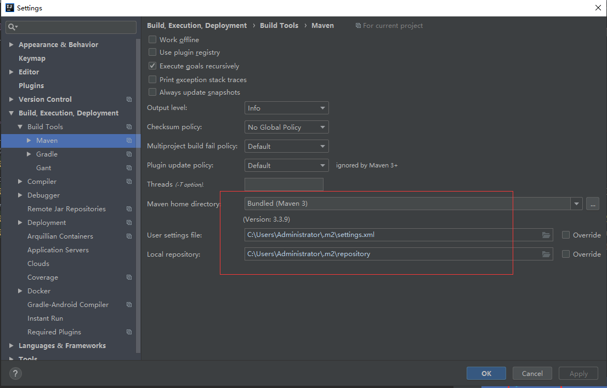
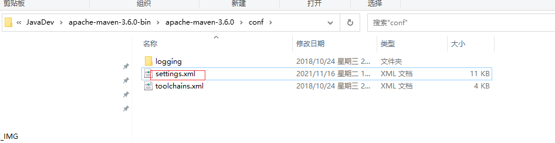
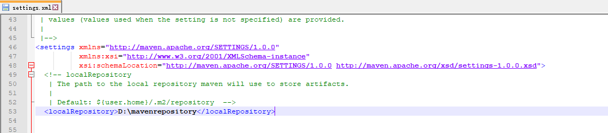
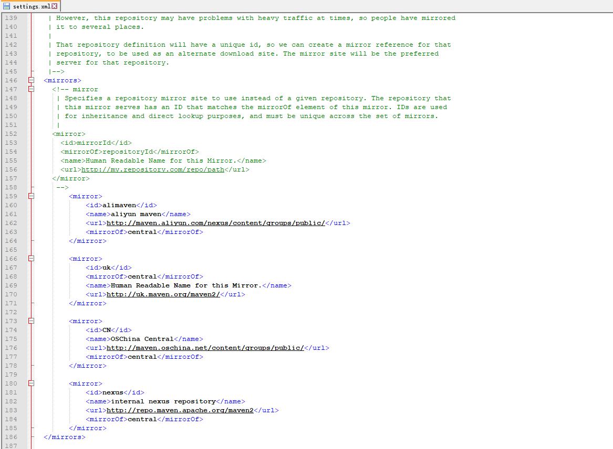
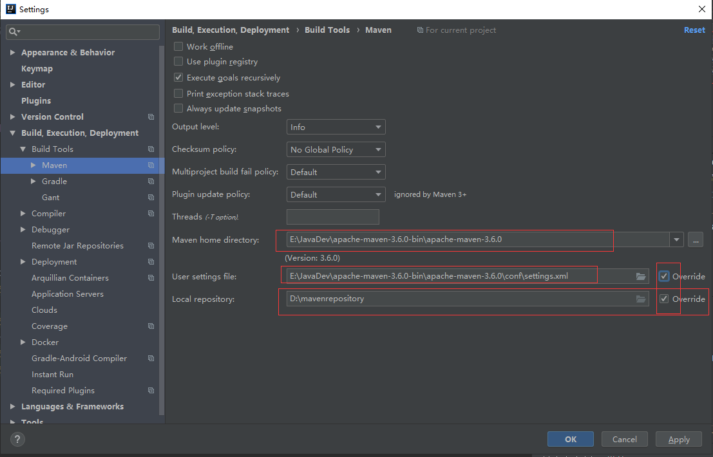
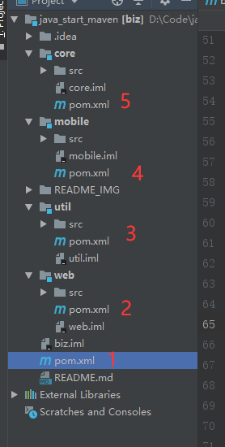
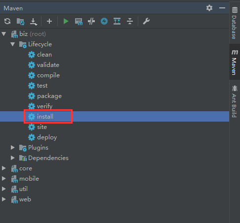
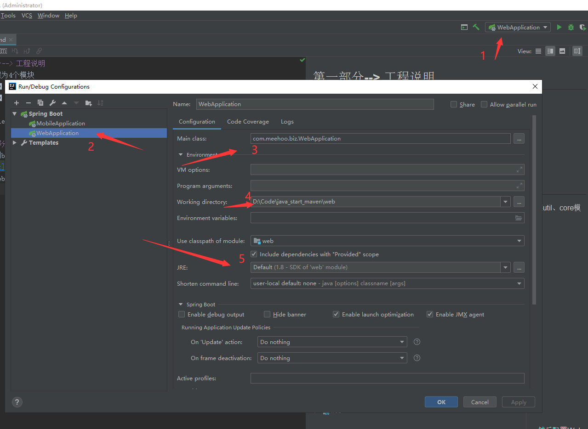
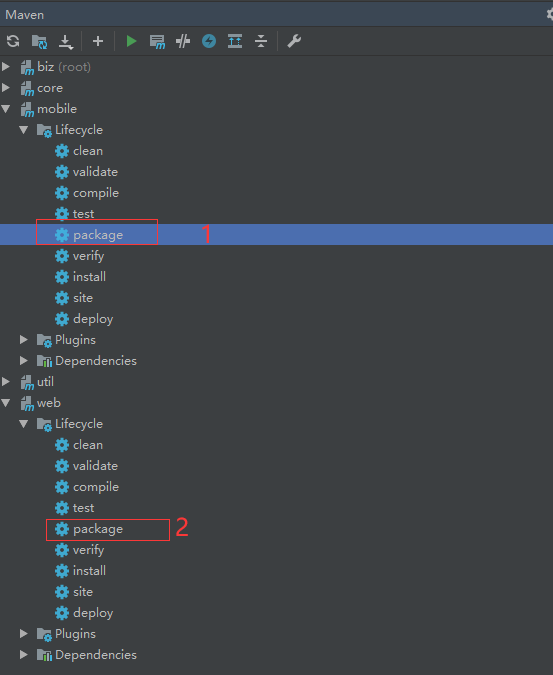
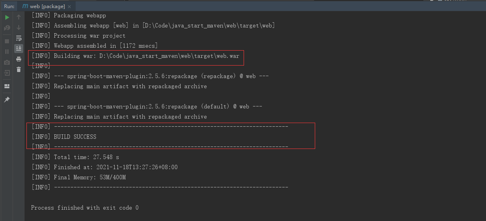

##第一部分--> Maven配置说明
idea默认自带了Maven插件，默认配置如下(使用默认的配置是可以的)：



但默认的配置会将依赖包下载到C:\Users\Administrator\.m2\repository目录下，随着项目的增多，C盘变得越来越大，
通常情况下，我们会自己去下载一个maven插件，maven插件官方下载地址为https://archive.apache.org/dist/maven/maven-3/，
这里我们选择下载maven的版本为3.6.0，下载后解压到本地目录E:\JavaDev\apache-maven-3.6.0-bin\apache-maven-3.6.0（可自己修改），
修改conf目录下的setting.xml



修改依赖jar本地保存目录如下：
  `<localRepository>D:\mavenrepository</localRepository>`
修改后如下图：



默认配置下，依赖的第三方jar会去国外的maven中心仓库下载，而我们可以通过修改下载地址为国内镜像加速下载依赖包，
修改下载依赖包的远程服务器镜像配置如下：
```
<mirror>
     <id>alimaven</id>
     <name>aliyun maven</name>
     <url>http://maven.aliyun.com/nexus/content/groups/public/</url>
     <mirrorOf>central</mirrorOf>
 </mirror>

 <mirror>
     <id>uk</id>
     <mirrorOf>central</mirrorOf>
     <name>Human Readable Name for this Mirror.</name>
     <url>http://uk.maven.org/maven2/</url>
 </mirror>

 <mirror>
     <id>CN</id>
     <name>OSChina Central</name>
     <url>http://maven.oschina.net/content/groups/public/</url>
     <mirrorOf>central</mirrorOf>
 </mirror>

 <mirror>
     <id>nexus</id>
     <name>internal nexus repository</name>
     <url>http://repo.maven.apache.org/maven2</url>
     <mirrorOf>central</mirrorOf>
 </mirror>
```
修改后如下图



然后再来idea配置如下：



##第二部分--> 工程说明
初始化工程为4个模块
1. 【util】       通用工具栏模块
2. 【core】       业务逻辑模块（包含Domain、Dao、Service、RO、VO)
3. 【web】        业务后台管理接口
4. 【mobile】     业务移动端接口

##第三部分--> 依赖的添加
maven工程是通过pom.xml文件来管理依赖和打包的，本工程一共有5个pom.xml文件，



最外层为父pom文件(上图标1的)，放置一些其他模块都通用的依赖配置，在开发过程中如果要添加全局依赖，则在最外层父pom文件中添加，
如确认只是某单个模块需要引用的jar则在对应模块下的pom文件中添加依赖即可。


##  第四部分--> 运行工程说明
首先在右侧biz模块下展开Lifecycle---双击install，运行install命令，安装util、core模块到本地maven仓库中，以便mobile和web模块引用，
一般只需安装一次即可，如后续碰到web和mobile模块找不到util或core包，再次重复安装一遍即可，如下图：



然后配置Web模块和Mobile模块进行本地调试（对于高版本的idea，可以直接运行，如直接运行不成功，则按如下图进行配置一下）



调试完成，打包web和mobile模块，双击右侧Maven侧边栏下web模块、mobile模块下Lifecycle----双击packeage命令生成war包，放到tomcat里面部署即可。


